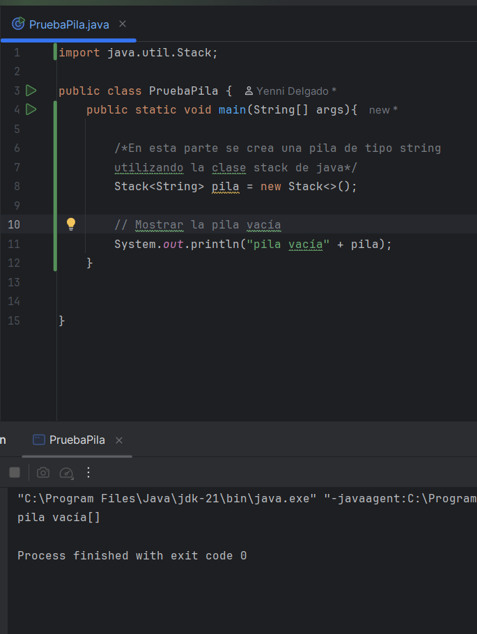
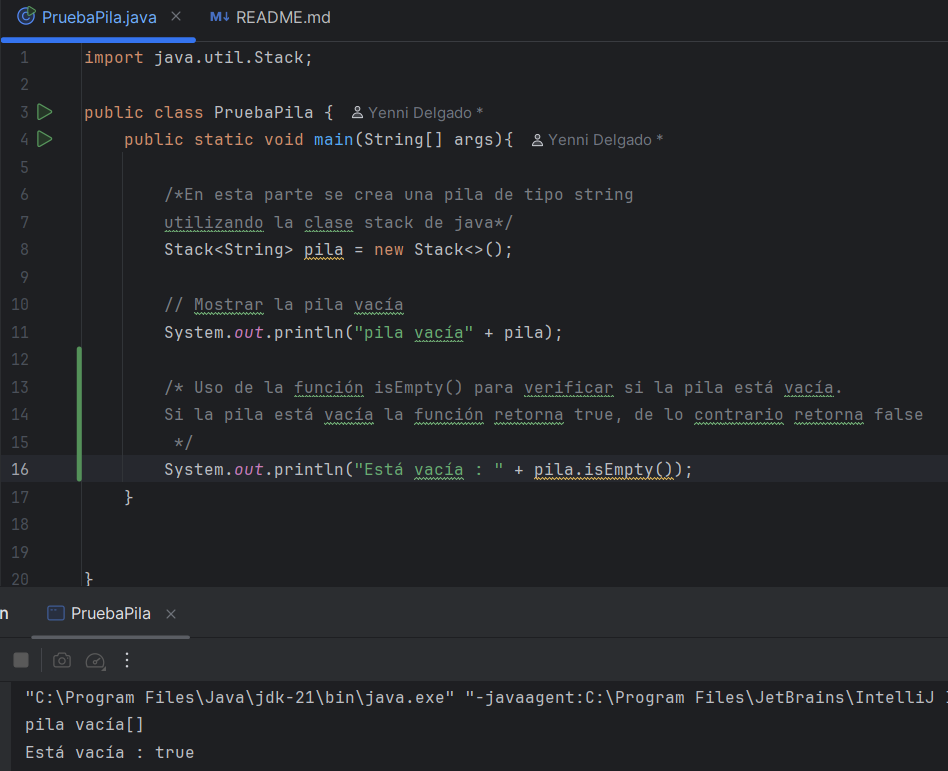
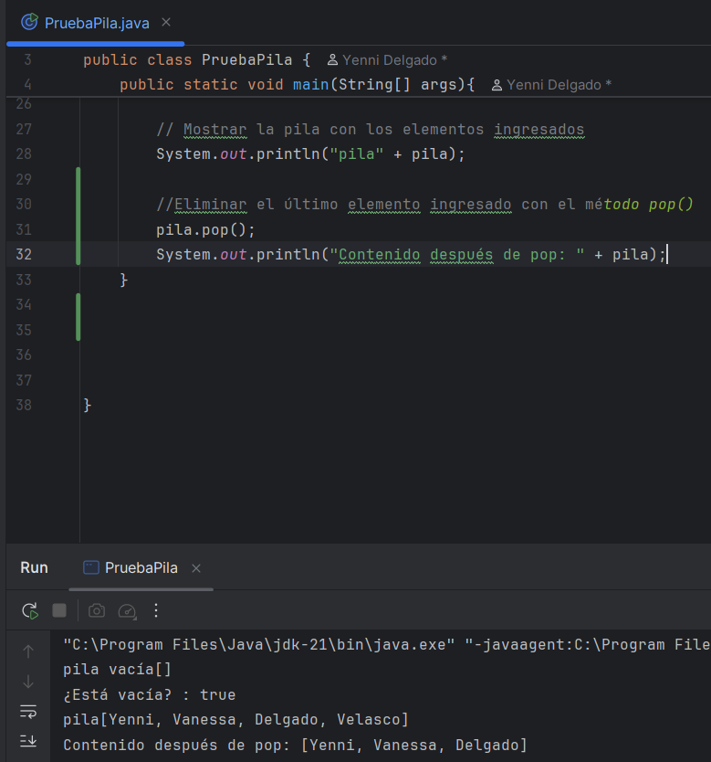
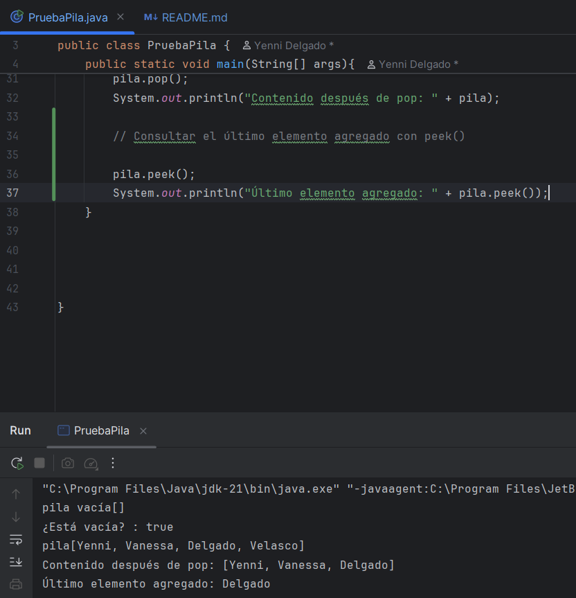

# Proyecto: Actividad - Pilas (Stack)

## Objetivo
El objetivo de este proyecto es comprender el funcionamiento de las pilas en Java y aplicarlas en un simulador de deshacer/rehacer (Undo/Redo) en un editor de texto simple.

Se implementaron dos partes principales:
1. Prueba de la pila (operaciones básicas).
2. Menú consola con Undo/Redo usando dos pilas.

---

## Integrantes del equipo

- **Yenni Vanessa Delgado**
    - Implementó la estructura de pila utilizando la clase `Stack` de Java.
    - Probó las operaciones fundamentales (`push`, `pop`, `peek`, `isEmpty`, `search`).
    - Subió la estructura inicial del repositorio en GitHub.

- **Gustavo Adolfo Merchancano Piedrahita**
    - Implementó la lógica de **Undo (Deshacer)** y **Redo (Rehacer)**.
    - Programó el menú en consola con las opciones: Escribir texto, Deshacer, Rehacer, Mostrar texto actual y Salir.
    - Integró y probó el programa completo para verificar el correcto funcionamiento.

---

## Archivos principales

### 1. PruebaPila.java
Este archivo contiene un programa sencillo que permite probar las operaciones básicas de una pila en Java usando la clase Stack.

Operaciones implementadas:
- `push()` → Agregar elementos a la pila.
- `pop()` → Eliminar el último elemento agregado.
- `peek()` → Consultar el último elemento sin eliminarlo.
- `isEmpty()` → Verificar si la pila está vacía.

**Ejecución paso a paso:**

1. Ejecución inicial mostrando la pila vacía.  
   )
2. Mostrar si la pila está vacía con `isEmpty()`

3. Inserción de elementos con `push()`.  
  

4. Eliminación de un elemento con `pop()`.  


5. Uso de `peek()` para ver el último elemento.  
  


---

### 2. Menu.java
Este archivo contiene el simulador de un editor de texto en consola que implementa las funciones de **Undo** y **Redo** utilizando dos pilas:

- **Pila principal (Undo):** almacena las acciones realizadas.
- **Pila secundaria (Redo):** almacena las acciones deshechas para poder rehacerlas.

Opciones del menú:
1. Escribir texto.
2. Deshacer (Undo).
3. Rehacer (Redo).
4. Mostrar texto actual.
5. Salir.

**Ejecución paso a paso:**

1. Ejecución inicial mostrando el menú.  
   

2. Inserción de texto en la pila principal.  
  

3. Ejemplo de uso de la opción **Deshacer**.  
  

4. Ejemplo de uso de la opción **Rehacer**.  
   

5. Visualización del texto actual con varias líneas escritas.  
  

6. Ejecución completa hasta salir del programa.  
 

---

## Instrucciones de ejecución

1. Clonar este repositorio:
   ```bash
   git clone https://github.com/yennivanessa97/Actividad-Pilas-Stack.git
